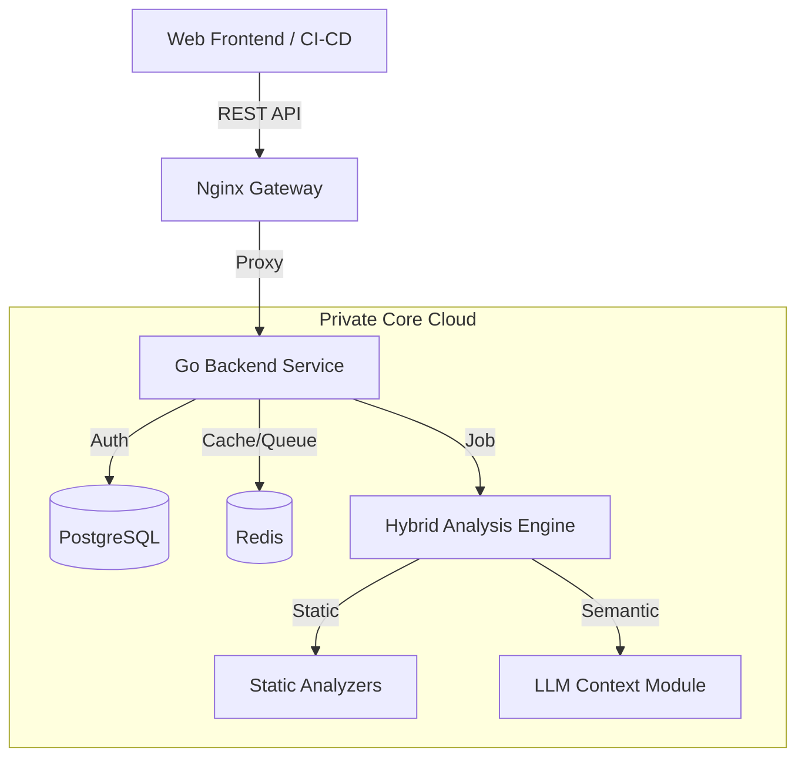

# Clapy — AI-Powered Smart Contract Auditor 🛡️

[](#)
[](#)
[](#)

**Clapy** is an intelligent security infrastructure for Web3 developers that provides real-time automated vulnerability detection and auto-remediation for smart contracts.

We combine **static analysis** with **generative AI** to detect complex logical errors that traditional linters miss, offering ready-to-merge code patches instantly.

## 🚀 Key Features

*   **Multi-Chain Support:** Deep analysis for **Solidity** (EVM), **Rust** (Solana/Near), and **Move** (Aptos/Sui).
*   **Hybrid Core:** A powerful combination of mathematical static analysis (e.g., Slither) and context-aware LLMs.
*.  **Custom AI Model:** Fine-tuned on 50,000+ audited contracts and real-world exploits to understand blockchain-specific vulnerabilities that general-purpose LLMs miss.
*   **Auto-Remediation:** Clapy doesn't just flag errors; it generates the corrected code block, ready for implementation.
*   **Instant Results:** Full security audit takes under 60 seconds (compared to weeks for manual reviews).
*   **Data Privacy:** Built on **Zero Trust** and **RAM-only** processing principles—your source code is never stored on disk and is wiped immediately after analysis.

---

## 🏗️ Architecture & Backend

> **Note:** This repository contains the Frontend (UI) code and infrastructure configurations. The source code for the **Analytical Core (Backend)** resides in a secure private repository to protect Intellectual Property (IP), but is available for review by investors and judges upon request.

The system is built on a microservices architecture to ensure high scalability and security:



### Core Tech Stack

- **Language:** Golang (Gin Framework) — chosen for high performance, strong typing, and concurrency support.
- **Database:** PostgreSQL — stores user metadata, audit logs, and report hashes (sensitive code is not stored).
- **Caching & Queues:** Redis — handles job queues for the scanner and rate limiting.
- **AI Engine:** A proprietary neural network specifically trained on smart contract vulnerabilities and blockchain security patterns. Our custom model is fine-tuned on a dataset of 50,000+ audited contracts and historical exploits, combined with static analyzers and RAG (Retrieval-Augmented Generation) for context-aware analysis of blockchain documentation.


## 🎯 Problem & Solution

Smart contracts manage billions of dollars, but the cost of a mistake is critical.

### Why current solutions fail

- **Manual Audits:** Cost $10k+ and take weeks. Inaccessible for early-stage startups.
- **Static Analyzers:** Produce hundreds of False Positives and lack understanding of business logic.
- **Lack of Context:** Developers are told "there is an error," but not why it matters or how to fix it safely.

### How Clapy solves this

Clapy acts as an AI Security Copilot. It understands the architectural context of your project and proposes fixes that respect your logic, lowering the barrier to entry for secure Web3 development.


## 💥 Preventable Incidents (Real-World Examples)

Clapy is trained on datasets of historical hacks to prevent scenarios like these:

| Protocol (Victim) | Loss  | Vulnerability Type         | Clapy Solution                                              |
|-------------------|-------|----------------------------|-------------------------------------------------------------|
| Nomad Bridge      | $190M | Uninitialized Variable     | Detection of zero-values in critical mappings/roots.        |
| Qubit Finance     | $80M  | Reentrancy                 | Automated insertion of nonReentrant modifiers.              |
| Euler Finance     | $197M | Logic Error / Flash Loan   | Analysis of attack vectors involving price manipulation.    |
| Beanstalk Farms   | $182M | Governance Attack          | Flash loan voting power simulation.                         |
| General           | N/A   | Missing Access Control     | Verification of onlyOwner modifiers and RBAC.               |


## 🛠️ Installation & Setup (Frontend)

To run the client-side interface locally for testing:

1. **Clone the repository:**
   ```bash
   git clone https://github.com/miraklik/clapy-public.git
   cd clapy-public
   ```

2. **Install dependencies:**
   ```bash
   cd frontend
   npm install
   ```

3. **Run the development server:**
   ```bash
   npm run dev
   ```

4. **Open** http://localhost:3000 in your browser.


## 🔒 Security & Privacy Policy

We understand that code is your most valuable asset.

- **No-Logs Policy:** We do not persist your smart contract source code.
- **Ephemeral Processing:** Analysis runs in isolated containers that are destroyed immediately after report generation.
- **Encryption:** All data in transit is protected via TLS 1.3.


## 🗺️ Roadmap

- **✅ Alpha Launch:** Support for Solidity, Rust, Move. Core AI analysis engine.
- **🔄 Web Dashboard:** User profile, scan history, PDF export.
- **⏳ CI/CD Integration:** Native GitHub Action for automated Pull Request scanning.
- **⏳ IDE Plugins:** Extensions for VS Code and Remix.


## 📞 Contact

For inquiries regarding the core architecture, partnership proposals, or API access:

- **Email:** clapy.ai@gmail.com
- **Telegram:** @miraclik


© 2025 Clapy.ai. Making Web3 security accessible to every developer.